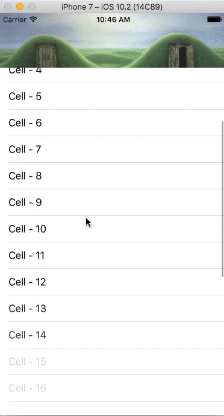
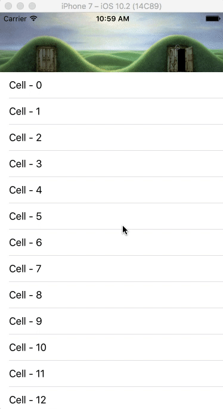
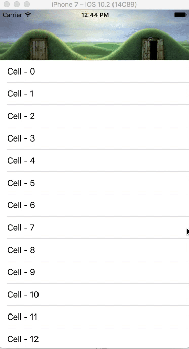
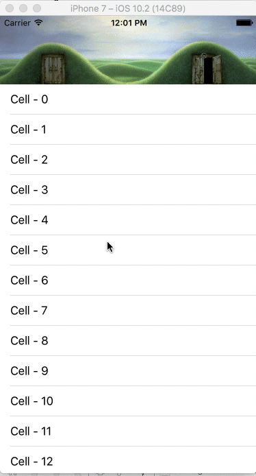
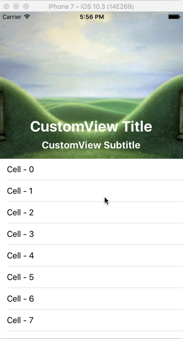

# KJNavigationViewAnimation

[](https://twitter.com/Kiranjasvanee)
[](https://github.com/KiranJasvanee/KJNavigationViewAnimation/blob/master/LICENSE)
[](https://github.com/KiranJasvanee/KJNavigationViewAnimation/issues)
[](https://github.com/KiranJasvanee/KJNavigationViewAnimation)
[](https://github.com/KiranJasvanee/KJNavigationViewAnimation)
[](https://github.com/KiranJasvanee/KJNavigationViewAnimation)

**NOTE:** Pod version requires 1.2.0 & later

## Preview
Animate your Custom View using `TableView, CollectionView OR ScrollView`.   <br />   <br />

**NOTE:** In below presentation, if animation looks laggy, wait till page completes it loading. It's smooth as you scrolls

&nbsp;&nbsp;&nbsp;&nbsp;&nbsp;&nbsp;&nbsp;&nbsp;&nbsp;&nbsp;&nbsp;&nbsp;&nbsp;&nbsp;&nbsp;*Animation up to statusbar*&nbsp;&nbsp;&nbsp;&nbsp;&nbsp;&nbsp;&nbsp;&nbsp;&nbsp;&nbsp;&nbsp;&nbsp;&nbsp;&nbsp;&nbsp;&nbsp;&nbsp;&nbsp;&nbsp;&nbsp;&nbsp;&nbsp;&nbsp;&nbsp;&nbsp;&nbsp;&nbsp;&nbsp;&nbsp;&nbsp;&nbsp;&nbsp;&nbsp;&nbsp;&nbsp;&nbsp;&nbsp;&nbsp;&nbsp;&nbsp;&nbsp;&nbsp;&nbsp;&nbsp;&nbsp;&nbsp;&nbsp;&nbsp;&nbsp;&nbsp;&nbsp;&nbsp;&nbsp;&nbsp;&nbsp;&nbsp;&nbsp;&nbsp;&nbsp;&nbsp;&nbsp;&nbsp;&nbsp;&nbsp;&nbsp;*Animation up to zero*  <br />  <br />
&nbsp;&nbsp;&nbsp;&nbsp;&nbsp;&nbsp;&nbsp;&nbsp;&nbsp;&nbsp;&nbsp;&nbsp;&nbsp;&nbsp;&nbsp;&nbsp;&nbsp;&nbsp;&nbsp;&nbsp;&nbsp;  <br />  <br />

&nbsp;&nbsp;&nbsp;&nbsp;&nbsp;&nbsp;&nbsp;&nbsp;&nbsp;&nbsp;&nbsp;&nbsp;&nbsp;&nbsp;&nbsp;&nbsp;&nbsp;&nbsp;*Animation up to custom value*&nbsp;&nbsp;&nbsp;&nbsp;&nbsp;&nbsp;&nbsp;&nbsp;&nbsp;&nbsp;&nbsp;&nbsp;&nbsp;&nbsp;&nbsp;&nbsp;&nbsp;&nbsp;&nbsp;&nbsp;&nbsp;&nbsp;&nbsp;&nbsp;&nbsp;&nbsp;&nbsp;&nbsp;&nbsp;&nbsp;&nbsp;&nbsp;&nbsp;&nbsp;&nbsp;&nbsp;&nbsp;&nbsp;&nbsp;&nbsp;&nbsp;&nbsp;&nbsp;&nbsp;&nbsp;&nbsp;&nbsp;&nbsp;*Animation up to zero without blurr*  <br />  <br />
&nbsp;&nbsp;&nbsp;&nbsp;&nbsp;&nbsp;&nbsp;&nbsp;&nbsp;&nbsp;&nbsp;&nbsp;&nbsp;&nbsp;&nbsp;&nbsp;&nbsp;&nbsp;&nbsp;&nbsp;&nbsp;

## Example

Things you can do, Please checkout example project to build similar.<br />  
&nbsp;&nbsp;&nbsp;&nbsp;&nbsp;&nbsp;&nbsp;&nbsp;&nbsp;&nbsp;&nbsp;&nbsp;&nbsp;&nbsp;&nbsp;*Animation up to custom value* <br />  <br />
 <br />  <br />

```swift 
// Pass objects for appearance and disappearance of those according to scrolling.
viewKJNavigation.disappearanceObjects(instances: [labelCustomViewTitle, labelCustomViewSubtitle])    
viewKJNavigation.appearanceObjects(instances: [viewNavigation])
```

## Requirements

- Swift 3.0.1+
- iOS 9.0+

## Installation

KJNavigationViewAnimation is available through [CocoaPods](http://cocoapods.org). To install
it, simply add the following line to your Podfile:

```ruby
pod 'KJNavigationViewAnimation', '~> 0.1.0'
```

## Usage

KJNavigationViewAnimation will be used via interface builder.

* Add Custom View `(UIView)` at the top in your interface builder. Add `KJNavigationViewAnimation` in `Class` property at Identity Inspector of added view.

* You've to add `Height` constraint to your Custom View, don't add identifier to it, library will detect height automatically.

  <br />
#### Properties
Use following properties to edit it's default functionality. Add your settings in `viewDidLoad`.

```swift 
// declare instance of KJNavigationViewAnimation by connecting it to UIView outlet in interface builder
@IBOutlet weak var viewKJNavigation: KJNavigationViewAnimation!
```
```swift 
override func viewDidLoad() {
        super.viewDidLoad()
        
        // For TableView
        viewKJNavigation.setupFor(Tableview: yourTableView,
                                  viewController: self)
        // Animate up to statusbar.
        viewKJNavigation.topbarMinimumSpace = .statusBar
        
        // If you want blurr background of navigation view.
        viewKJNavigation.isBlurrBackground = true
        
        // assign delegate of TableView, CollectionView OR ScrollView with self.
        tableview.delegate = self
}
```
```swift
// For CollectionView
viewKJNavigation.setupFor(CollectionView: yourCollectionView,
                          viewController: self)
```

```swift
// For ScrollView
viewKJNavigation.setupFor(Scrollview: yourScrollView,
                          viewController: self)
```

```swift
// Animate up to zero.
viewKJNavigation.topbarMinimumSpace = .none
```
```swift
// Animate up to custom property.
viewKJNavigation.topbarMinimumSpace = .custom(height: 64)
```
  <br />
  
#### Methods
You have to extend your `viewController` class with `UIScrollViewDelegate`, and connect `TableView, CollectionView OR ScrollView delegate to self`. Last step to call `KJNavigationViewAnimation scrollview methods` as below from `UIScrollViewDelegate delegate methods`

```Swift
extension ViewController: UIScrollViewDelegate {
  func scrollViewDidScroll(_ scrollView: UIScrollView) {
        // viewKJNavigation is my declared KJNavigationViewAnimation property in ViewController class
        viewKJNavigation.scrollviewMethod?.scrollViewDidScroll(scrollView)
  }
  func scrollViewWillBeginDragging(_ scrollView: UIScrollView) {
        viewKJNavigation.scrollviewMethod?.scrollViewWillBeginDragging(scrollView)
  }
  func scrollViewDidEndDragging(_ scrollView: UIScrollView, willDecelerate decelerate: Bool) {
        viewKJNavigation.scrollviewMethod?.scrollViewDidEndDragging(scrollView, willDecelerate: decelerate)
  }
  func scrollViewDidEndDecelerating(_ scrollView: UIScrollView) {
        viewKJNavigation.scrollviewMethod?.scrollViewDidEndDecelerating(scrollView)
  }
}
```

## Author

**Skype:** kiranjasvanee
Kiran Jasvanee, kiran.jasvanee@yahoo.com

## License

KJNavigationViewAnimation is available under the MIT license. See the LICENSE file for more info.
